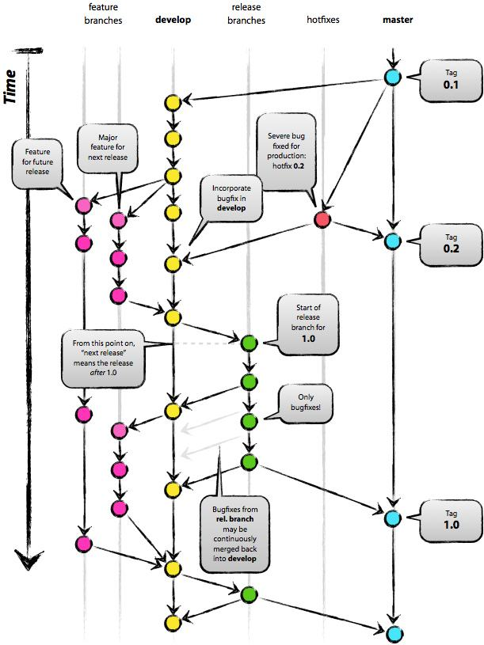

# git-practica-2
Segunda práctica de git. Configurar IntelliJ y hacer algunos merges con conflictos.

Para esta segunda práctica vamos a hacer algunos merges que tendrán conflictos. Es decir, git no será capaz de resolver por sí solo los conflictos entre los cambios de dos ramas y tendremos que resolverlos nosotros. 

Una forma de hacerlo es via consola, pero tal y como habréis podido comprobar github nos obliga a introducir la contraseña cada dos por tres. Esto se debe al protocolo de seguridad que utiliza github, que es independiente de la herramienta git. 

Para resolver los conflictos se puede realizar por consola (os dejo la info más abajo) pero en nuestro caso los resolveremos con las herramientas visuales que nos proporciona IntelliJ. 

## Merges y resolución de conflictos por consola
No es necesario que hagáis por consola. Al menos para estas pruebas. Pero será interesante que le deis un vistazo a los siguientes enlaces ya que os serán de utilidad.

### Merges

  https://www.atlassian.com/es/git/tutorials/using-branches/git-merge
  
### Conflictos

  https://www.atlassian.com/es/git/tutorials/using-branches/merge-conflicts


## Configurar IntelliJ para usar Git

Abrimos IntelliJ y vamos a Archivo -> Configuración  -> Control de versiones -> Git

Con atajo de teclado sería  Ctrl + Shift + s (Archivo -> Configuración) -> Control de versiones -> Git

Añadimos la Ruta al ejecutable de Git, seleccione el archivo git.exe instalado, haga clic en Prueba, la configuración de prueba debería ser exitosa.

Ahora veremos que tenemos un menú especial en IntelliJ dedicado solo a Git con un montón de opciones.

## Configurar GitHub en IntelliJ
Configure GitHub en IDEA, Archivo -> Configuración-> Control de versiones -> GibHub

　　Host：github.com

Token: haga clic en Crear token API, ingrese el nombre de usuario y la contraseña registrados en github para generar el token

Haga clic en Probar para probar si la conexión es exitosa.

Si no tenemos configurado el token en el primer uso del repositorio, nos pedirá un token para autorizar al IDE a acceder al repo. Para crear el token, vamos a las “Settings” de nuestro perfil de GitHub, pulsamos sobre “Developer Settings” -> “Personal access tokens”. En la siguiente ventana, le damos un nombre que lo identifique, elegimos el scope “repo” y pulsamos sobre “Generate token”.

Una vez generado el token, volviendo a IntelliJ, lo pegamos en el diálogo en el que nos quedamos y, si todo ha ido ok, veremos como nos sincroniza nuestra config y podremos ver el commit en el repositorio.

Estas configuraciones no tendremos que voler a hacerlas con ningún repositorio de nuestra cuenta.

## Ejemplo workflow de ramas 

En el siguiente gráfico veremos cómo desarrollar creando ramas según el workflow git flow



De la rama develop salen y se fusionan las ramas de las mejoras a implementar y las ramas de preparación de código a producción release-. Cuando hay un error en producción a corregir, crearemos una rama hotfix- que saldrá y se fusionará en master para desplegar a producción y en develop para continuar desarrollando las nuevas funcionalidades sin bugs.

Extension para automatizar GIT flow. https://github.com/nvie/gitflow. Ofrece comandos para facilitar la creacion de features, hotfix, etc…

En cuanto a los TAGS digamos que son marcas para encontrar más fácilmente ciertos momentos de un proyecto como puede ser una Release o un cambio importante a remarcar.

## Haz un fork del repositorio creado para la práctica 2 del taller
- Haz el fork de este proyecto
- Clona el proyecto (puedes hacerlo por consola o IntelliJ)
- Añade un fichero clientes.sql que tenga lo siguiente
   ```sql
      create table clientes(
         id int primary key auto_increment,
         nombre varchar(50),
         apellidos varchar(50),
         edad int,
         direccion varchar(50)
      );
   ```
- Haz commit y push
- Crea una rama nueva desde IntelliJ
  - Git -> Branches -> New branch -> le asignamos un nombre a nuestra nueva rama "develop"
- Modifica el fichero para que quede de la siguiente forma
   ```sql
      create table clientes(
         id int primary key auto_increment,
         nombre varchar(50),
         apellidos varchar(60),
         edad int,
         direccion varchar(60)
      );
      select * from clientes;
   ```     
- Haz commit y push de la nueva rama y vuelve a la rama main
- Ahora vamos a crear otra rama que se llamará feature/new_fields
- Modifica el fichero para que quede de la siguiente forma
   ```sql
      create table clientes(
         id int primary key auto_increment,
         nombre varchar(50),
         apellido1 varchar(50),
         apellido2 varchar(50),
         sexo varchar(1),
         edad int,
         direccion varchar(50)
      );
   ``` 
- Haz commit y pushea los cambios y la rama
- Fijate en qué cosas cambian en cada uno de los dos sitios.
- Ahora vamos a [mergear los cambios](https://www.jetbrains.com/help/idea/resolving-conflicts.html#distributed-version-control-systems) de develop a feature/new_fields
  - Git -> Merge -> Seleccionamos la rama con la que queremos mergear (develop)
  - Nos saldrá un popup con el fichero y nos dirá que tenemos conflictos y varias opciones (Aceptar los de develop, quedarnos con los nuestros o mergear). Vamos a mergear!
  - A la izquierda nos saldrán los que tenemos actualmente en nuestro repositorio local que corresponde a la rama feature/new_fields y a la derecha los de la rama develop. El resultado final es el centro. 
  - Veremos que las líneas que no tienen conflictos importantes saldrán con unas flechas verdes y las que son complicadas de resolver en rojo. Si pulsamos en alguno la aspa X no se pasarán los cambios al centro.
  - Mergea para que el resultado final sea lo siguiente:
   ```sql
      create table clientes(
         id int primary key auto_increment,
         nombre varchar(50),
         apellido1 varchar(50),
         apellido2 varchar(50),
         sexo varchar(1),
         edad int,
         direccion varchar(60)
      );
      select * from clientes;
   ``` 
  - Ahora haz commit con los cambios y haz push del repositorio feature/new_fields a origin

Vale, ahora tenemos feature/new_fields mergeado con los cambios de develop. Esto quiere decir que nuestro nuevo desarrollo ya está alineado con develop. Ahora verificaríamos que todo funciona correctamente y una vez esté todo ok será el momento de mergear nuestros cambios a develop.
